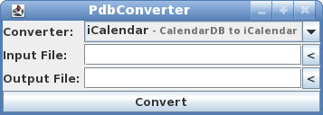

# PdbConverter

_PdbConverter_ is a tool for converting PalmOS PDB files into more common file formats.



## Features

* Calender can be converted to iCalendar and imported into most calendar applications.
* Address can be converted to vCard and imported into many address books.
* Also supports Memo, ToDo and Notepad.
* Also supports `DateBook.mdb` files.
* All other PDBs can be converted into a ZIP file containing the raw record data, for further processing.
* Optional category filter and separate export of each category.
* Developers can use PdbConverter to parse PDB files in their own application, just by adding a Maven dependency.
* Completely written in Java, and runs on Linux, MacOS X and Windows. Also usable as Android library (untested).

## Usage

Please install [Java](http://java.com), then download the latest precompiled jar from [GitHub](https://github.com/shred/pdbconverter/releases/) and run it:

```
java -jar pdbconverter.jar --gui
```

See the [online documentation](http://www.shredzone.org/maven/pdbconverter/) for further details.

## License

_PdbConverter_ is distributed under [Gnu Public License v3](http://www.gnu.org/licenses/gpl-3.0.html).
